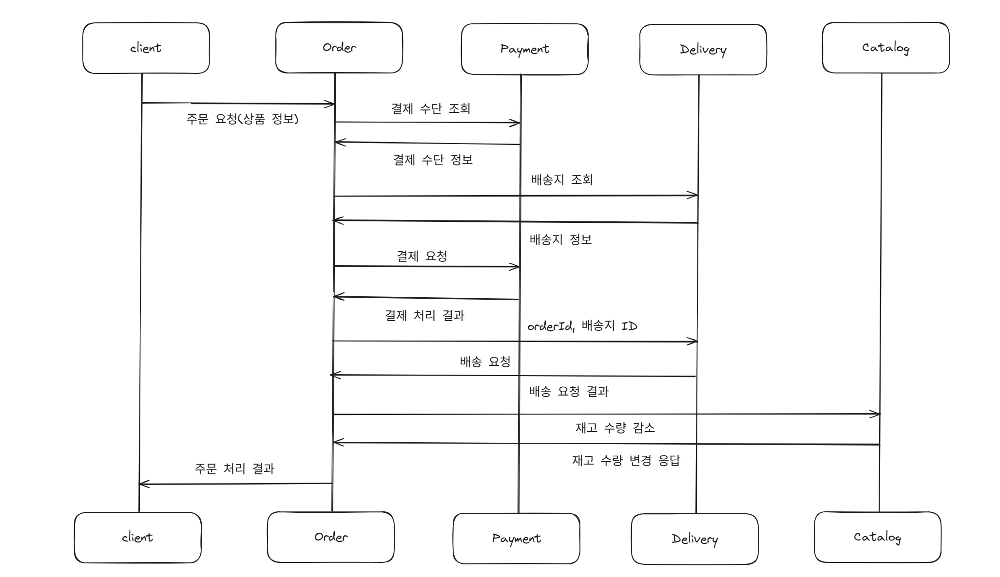

# Black-Friday-Project
블랙프라이데이 EDA 기반 아키텍처 프로젝트 입니다.

### 아키텍처

- 아키텍처는 위와 같다. 여러 개의 마이크로 서비스를 이루고 있으며 각각에 대해서 Event Broker를 둬서 통신할 수 있도록 하는 구조를 이루고 있다.

---

### 학습 목표

- MSA로 서비스를 구성할 수 있게 된다.
- EDA의 개념과 목적을 이해한다.
- 이벤트 브로커의 개념과 Kafka의 기능을 익히고 사용할 수 있게 된다.
- java, spring 환경에서 이벤트를 publish/consume 하여 비즈니스 로직을 구성할 수 있게 된다.
- NoSQL의 개념과 Cassandra의 기본 개념을 익히고 사용할 수 있게 된다.
- 테스트 코드를 통해서 유지보수성을 높이는 방법을 익힌다.
- 성능테스트를 수행해 서비스가 보장할 수 있는 기준치를 측정할 수 있게 된다.

---

### 기술 스택

|  |  |  |
| --- | --- | --- |
| 실습 환경 | JDK 17 IDE intellij Community edition | Window/Mac 둘다 가능하지만 설명은 Mac 기반 |
| 기술 분류 | Spring Boot3.2 Docker 20.10 (Docker Desktop) | 오픈소스 Docker Desktop은 개인 무료용 |
| 기술 분류 데이터 | Apache Kafka(3.6.0) MySql 5.7 Redis(7.2) Cassandra(4.1) | 오픈소스 |
| 성능 테스트 | Apache JMeter(5.6.2) | 로컬 환경에서 진행 |

### 요약

온라인으로 상품을 등록하고 판매하는 e-commerce 시스템으로, 다량의 데이터와 높은 동시접속자 수 환경에서 안정적으로 요청을 처리할 수 있다.

요구사항 수집

- 판매자는 상품을 등록할 수 있다.
- 판매자는 상품의 설명, 수량 등 정보를 관리할 수 있다.
- 구매자는 상품을 구매할 수 있다.
- 구매자는 상품을 검색할 수 있다.
- 구매자는 결제 수단을 등록하고 주문시 사용할 수 있다.
- 구매자는 배송지를 등록하고 주문시 사용할 수 있다.
- 구매자는 완료된 주문의 상태를 조회할 수 있다.
- 구매자는 완료된 주문의 배송 상태를 조회할 수 있다.
- 구매자는 주문 내역 리스트를 볼 수 있다.
- 구매자는 회원으로 등록할 수 있다.
- 회원은 로그인을 할 수 있다.

**서비스 분할**

Catalog

역할 : 상품 정보 관리

기능 : 

- 상품 등록 : POST /catalog/products
- 상품 수정 : PUT /catalog/products/{productId}
- 상품 수량 변경 : POST /catalog/change-inventory-count
- 상품 조회 : GET /catalog/product/{productId}
- 상품 검색 : POST /catalog/search

→ 복잡한 쿼리를 body로 넘긴다.

Payment

역할 : 결제 처리와 관련된 작업

기능 :

- 결제 수단 등록 : POST /payment/methods
- 결제 수단 변경 : PUT /payment/methods/{methodId}
- 결제 : POST /payment/process-payment
- 결제 결과 조회 : GET /payment/payments/{paymentId}

Order

역할 : 주문 처리를 수행하고 상태를 관리

기능 : 

- 상품 주문 : POST /order/process-order
- 주문 상태 조회 : GET /order/orders/{orderId}
- 주문 내역 보기 : GET /order/orders

Delivery

역할 : 주문 완료된 제품 배송, 상태 관리

기능 : 

- 배송지 등록 : POST /delivery/addresses
- 배송 처리 : POST /delivery/process-delivery
- 배송 상태 조회 : GET /delivery/deliveries/{deliverId}

Member

역할 : 회원 등록 관리와 인증

기능 : 

- 회원 등록 : POST /member/registration
- 회원 정보 관리 : PUT /member/members/{userId}
- 로그인 : POST /member/login

---

### 시퀀스 다이어그램

---

### 아키텍처 고려사항

- 대용량 트래픽 처리 : 동시에 많은 요청을 처리
- 탄력성 : 급증하는 트래픽 처리
- 안정성 : 트래픽 급증 또는 일부 장애 시 에러 최소화

요구 성능 계산

주요 목표 : 100만명 동시 접속자 처리

- 동시 접속자 수 100만명
- 100만명이 10분에 한번씩 구매
- 분당 10만건 구매 처리
- 초당 1666건의 구매 처리

대용량 트래픽 처리

⇒ 스케일 아웃을 이용한 분산 처리, 일부 데이터 NoSQL 적용

⇒ 탄력성 : 스케일 아웃을 이용해서 대응, EDA를 사용한 보완

⇒ 안정성 : EDA를 사용한 비동기 처리함으로써 장애 전파 최소화

병목 지점

- 빈번한 상품 정보 변경 → NoSQL 사용
- 주문 처리 시 결제, 배송 관련 외부 시스템의 병목 → EDA

EDA 적용 가능한 부분

- 결제 처리(외부 연동을 통해야 하기 때문에 처리가 오래걸릴 수 있음)
- 배송 처리(배송 요청시 응답이 필요 없고 수행해야 하는 동작만 있어서 비동기 처리에 적합)
- 검색어에 대한 캐시 업데이트(약간의 지연이 허용되기 때문에 비동기 & 대량 처리가 용이)
